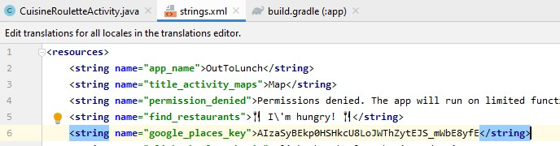

# Place Search - Using Google Places API
> By Irena Liu

> Last updated: July 8th, 2020

This document outlines a general guideline for how to set up a project to use Google's Place Search using the Google Places API. The Place Search will return a list of places based on a user's location or search string.

---
## Overview

1. Setting Up Project/ Getting Started with Google Maps
    - create android studio project
    - import Google-play-services SDK
    - get a Google Maps API key and a Google Places API key
    - add uses-permissions & the Google Maps API key to AndroidManifest.xml
2. Prepare Map
    - create a SupportMapFragment in the Layout
    - render Map
3. Get the Current Location
    - ensure Google Play services is installed on the device (Recommended)
    - check Location Permissions
    - get the last known location
    - sync map with current location
4. Construct the Request URL
    - Find Place Request
    - Nearby Search Request
    - Text Search Request
5. Execute Request Url
6. Displaying Places on a Google Map

> Official Documentation / Helpful Videos

---
## 1 - Setting Up Project/ Getting Started with Google Maps

### Step 1) Create a new Android Studio project
Create an Empty Activity. If you choose to create a Maps Activity, the steps will be a bit different.

### Step 2) Import Google-play-services SDK
Click on Tools > SDK Manager, then click on the SDK Tools tab. Make sure "Google Play services" is installed.


Next, we need to add Google Play Services to the new project. Go to your build.gradle file and add the following Google Services dependencies. Click Sync in the top right after adding.
```java
    //Google Services Dependencies
    implementation 'com.google.android.gms:play-services-maps:17.0.0'
    implementation 'com.google.android.gms:play-services-location:17.0.0'
    implementation 'com.google.android.gms:play-services-nearby:17.0.0'
```

*Alternatively:* 

You can add Google Play Services in the following way too. Click on File > Project Structure, then the plus icon followed by "Library Dependency" to search for the dependencies required. Search for play-services-maps, play-services-location, and play-services-nearby. Add the most up-to-date versions which should be 17.0.0. Make sure you add all the same versions.


### Step 3) Get a Google Maps API key and a Google Places API key
Before you begin: Before you start using the Places API, you need a project with a billing account and the Places API enabled. To learn more, read "Get Started with Google Maps Platform" in the official documentation I've linked below.

For now, click [here](https://cloud.google.com/maps-platform/#get-started) to go to the Google Console. You will need to login to your Google Account.

After you agree to the terms of service, it should take you to the overview page of the Google Cloud Platform. You can explore other Google APIs here.


Next, create a new project by clicking on "Select a project" in the upper left hand part of the screen and selecting **"New Project"**.

*Maps SDK for Android* & *Google Places API* will both need to be enabled. Click on Marketplace in the left hand pane then search for Maps SDK for Android. Click on **Enable**. Do the same for the Places API.

Next, we are going to create the two API keys. Click on "Credentials" in the left hand pane, then click on the link on the page, **"Credentials in APIs & Services"**. Click on Create Credentials to create a new API key.


Copy the API key, and for best practices, you should restrict your API key to the API it will be used for to make it secure. This one will be for Google Maps. Save this key as a string resource in the **strings.xml** file.

Create another key for Google Places. Restrict the key and save this key as a string resource too.



*Note: If you have a MapsActivity, paste the Google Maps key into the **google_maps_api.xml** resource file created in your android project.*

### Step 4) Add uses-permissions & the Google Maps API key to AndroidManifest.xml
Insert the following code snippet in the AndroidManifest.xml as a child of the `<application>` element.

```java
<meta-data
            android:name="com.google.android.geo.API_KEY"
            android:value="@string/google_maps_key" />
```
Add the following 5 uses-permissions right before the start tag of `<application>`:

```java
    <uses-permission android:name="android.permission.ACCESS_FINE_LOCATION" />
    <uses-permission android:name="android.permission.ACCESS_COARSE_LOCATION" />
    <uses-permission android:name="android.permission.ACCESS_NETWORK_STATE" />
    <uses-permission android:name="android.permission.INTERNET" />
    <uses-permission android:name="com.google.android.providers.gsf.permission.READ_GSERVICES" />
```

## 2 - Prepare Map
There's a couple things we need to set up for the map to show.

### Step 1) Create a SupportMapFragment in the Layout
Create a map fragment in the activity layout file. This fragment is the simplest way to place a map in an application.

```java
    <fragment
        xmlns:android="http://schemas.android.com/apk/res/android"
        xmlns:tools="http://schemas.android.com/tools"
        android:name="com.google.android.gms.maps.SupportMapFragment"
        android:layout_width="match_parent"
        android:layout_height="match_parent"/>
```

Get the map fragment view in the onCreate method of the activity:
```java
    //variable
    private SupportMapFragment mSupportMapFragment;

    //get view in the onCreate method
    @Override
    protected void onCreate(Bundle savedInstanceState) {
        super.onCreate(savedInstanceState);
        setContentView(R.layout.activity_main);

        
        mSupportMapFragment = (SupportMapFragment) getSupportFragmentManager()
                .findFragmentById(R.id.act_main_map_fragment);
        mSupportMapFragment.getMapAsync(MainActivity.this);
    }

```

### Step 2) Render Map
There's supposedly two ways of doing this. You can either add a new OnMapReadyCallback to the getMapAsync method or you can implement the OnMapReadyCallback interface on the activity and then initialize the map in the override method.

1st way:
```java
    mSupportMapFragment.getMapAsync(googleMap -> {
        //when map is ready
        mGoogleMap = googleMap;
    });
```

Alternatively: This is the preferred way.
```java
    public class MainActivity extends AppCompatActivity implements
        OnMapReadyCallback {
        @Override
        public void onMapReady(GoogleMap googleMap) {
            mMap = googleMap;
        }
    }
```

## 3 - Get the Current Location

### Step 1) Ensure Google Play services is installed on the device (Recommended)
Create an instance of GoogleApiClient.

The GoogleApiClient object provides the main entry point for Google Play services integration. The class has been deprecated but it will still work. It is suggested to use GoogleApi based APIs instead such as the new **GoogleSignInClient** class which includes authentication and does not require waiting for multiple callbacks. For more info, click [here](https://developers.google.com/android/reference/com/google/android/gms/common/api/GoogleApi).

GoogleApiClient instances are not thread-safe. To access Google APIs from multiple threads simultaneously, create a GoogleApiClient on each thread. GoogleApiClient service connections are cached internally, so creating multiple instances is fast. 

Example of creating GoogleApiClient:
```java
    protected synchronized void buildGoogleApiClient() {
        mGoogleApiClient = new GoogleApiClient.Builder(this)
                .addConnectionCallbacks(this)
                .addOnConnectionFailedListener(this)
                .addApi(LocationServices.API)
                .build();

        mGoogleApiClient.connect();
    }
```

You will then need to implement the GoogleApiClient.ConnectionCallbacks, GoogleApiClient.OnConnectionFailedListener and LocationListener interfaces. Add the override methods the app will require by pressing ALT + Enter where there is an error.


### Step 2) Check Location Permissions
Check that the user has allowed the app access to use location services in the onCreate method of your activity.
The location permission you will need to check for is the ACCESS_FINE_LOCATION. I would also recommend checking for the ACCESS_COARSE_LOCATION permission.

Example of how to check for the permissions:
```java
    //the permissions we need
    String[] permissions = {Manifest.permission.ACCESS_FINE_LOCATION, Manifest.permission.ACCESS_COARSE_LOCATION};

    if (ContextCompat.checkSelfPermission(this.getApplicationContext(), Manifest.permission.ACCESS_FINE_LOCATION) == PackageManager.PERMISSION_GRANTED) {
        if (ContextCompat.checkSelfPermission(this.getApplicationContext(), Manifest.permission.ACCESS_COARSE_LOCATION) == PackageManager.PERMISSION_GRANTED) {
            //permissions granted
        } else {
            //need to ask for permissions
            ActivityCompat.requestPermissions(this, permissions, REQUEST_LOCATION_CODE);

            // REQUEST_LOCATION_CODE is an
            // app-defined int constant. The callback method gets the
            // result of the request.
        }
    } else {
        ActivityCompat.requestPermissions(this, permissions, REQUEST_LOCATION_CODE);
    }
```

You will need to handle the result of requesting permissions with an override method.

Example of request permissions response handler:
```java
    @Override
    public void onRequestPermissionsResult(int requestCode, @NonNull String[] permissions, @NonNull int[] grantResults) {
        switch (requestCode) {
            case REQUEST_LOCATION_CODE:
                //is permission granted?
                if (grantResults.length > 0 && grantResults[0] == PackageManager.PERMISSION_GRANTED) {
                    //permission granted
                    // do some location-related task here
                    
                } else {
                    //permission denied
                    Toast.makeText(this, "Permission Denied", Toast.LENGTH_SHORT).show();
                }
                return;
        }
    }
```

### Step 3) Get the last known location
FusedLocationProviderClient is the replacement for FusedLocationProviderApi which is used to get the last known GPS location. 

To initialize the client, write the following:
```java
    //initializing the fused location provider client
    mFusedLocationProviderClient = LocationServices.getFusedLocationProviderClient(this);
```

Example of how to get the last location:
```java
    Task locationTask = mFusedLocationProviderClient.getLastLocation();
    locationTask.addOnCompleteListener(task -> {
        if (locationTask.isSuccessful()) {
            //found location!
            Location currentLocation = (Location) locationTask.getResult();
        } else {
            //location not found
            Toast.makeText(MapsActivity.this, "unable to get current location", Toast.LENGTH_SHORT).show();
        }
    });
```

### Step 4) Sync map to the current location
We are getting the map asynchronously. You can sync the map to the current location of the user by adjusting the camera. The last parameter of the animateCamera method is the zoom factor.

```java
    //sync map
    mGoogleMap.animateCamera(CameraUpdateFactory.newLatLngZoom(new LatLng(location.getLatitude(), location.getLongitude()), 10));
```

## 4 - Construct the Request Url
There are 3 different types of request urls depending on what kind of data you are hoping to return.

    **3 Options for Request Urls:**
    Data can be outputted as JSON or xml

    https://maps.googleapis.com/maps/api/place/findplacefromtext/output?parameters
    
    https://maps.googleapis.com/maps/api/place/nearbysearch/output?parameters

    https://maps.googleapis.com/maps/api/place/textsearch/output?parameters


The following information is taken from the Official Google Developers Documentation. You can check out the link at the end of this document.

#### Find Place Request
- A Find Place request takes a text input and returns a place.

***Example***

The following example shows a Find Place request for "Museum of Contemporary Art Australia", including the photos, formatted_address, name, rating, opening_hours, and geometry fields:
```
    https://maps.googleapis.com/maps/api/place/findplacefromtext/json?input=Museum%20of%20Contemporary%20Art%20Australia&inputtype=textquery&fields=photos,formatted_address,name,rating,opening_hours,geometry&key=YOUR_API_KEY
```

***Required parameters***

key — Your application's API key. This key identifies your application. 

input — Text input that identifies the search target, such as a name, address, or phone number. The input must be a string. Non-string input such as a lat/lng coordinate or plus code generates an error.

inputtype — The type of input. This can be one of either textquery or phonenumber. Phone numbers must be in international format (prefixed by a plus sign ("+"), followed by the country code, then the phone number itself).

***Optional parameters***

language — The language code, indicating in which language the results should be returned, if possible. Searches are also biased to the selected language; results in the selected language may be given a higher ranking.

locationbias — Prefer results in a specified area, by specifying either a radius plus lat/lng, or two lat/lng pairs representing the points of a rectangle. If this parameter is not specified, the API uses IP address biasing by default.


#### Nearby Search Request
- A Nearby Search lets you search for places within a specified area.

***Example***

The following example is a search request for places of type 'restaurant' within a 1500m radius of a point in Sydney, Australia, containing the word 'cruise':
```
https://maps.googleapis.com/maps/api/place/nearbysearch/json?location=-33.8670522,151.1957362&radius=1500&type=restaurant&keyword=cruise&key=YOUR_API_KEY
```

***Required parameters***

key — Your application's API key. This key identifies your application. 

location — The latitude/longitude around which to retrieve place information. This must be specified as latitude,longitude.

radius — Defines the distance (in meters) within which to return place results. The maximum allowed radius is 50 000 meters. 

***Optional parameters***

keyword — A term to be matched against all content that Google has indexed for this place, including but not limited to name, type, and address, as well as customer reviews and other third-party content.

language — The language code, indicating in which language the results should be returned, if possible. 

minprice and maxprice (optional) — Restricts results to only those places within the specified range. Valid values range between 0 (most affordable) to 4 (most expensive), inclusive. 

name — A term to be matched against all content that Google has indexed for this place. Equivalent to keyword. The name field is no longer restricted to place names. 

opennow — Returns only those places that are open for business at the time the query is sent. Places that do not specify opening hours in the Google Places database will not be returned if you include this parameter in your query.

rankby — Specifies the order in which results are listed. Note that rankby must not be included if radius (described under Required parameters above) is specified. 

    Possible values are:

    1. prominence (default)

    This option sorts results based on their importance. Ranking will favor prominent places within the specified area. Prominence can be affected by a place's ranking in Google's index, global popularity, and other factors.

    2. distance. 

    This option biases search results in ascending order by their distance from the specified location. When distance is specified, one or more of keyword, name, or type is required.

    3. type

    Restricts the results to places matching the specified type. Only one type may be specified (if more than one type is provided, all types following the first entry are ignored)

    4. pagetoken
    
    Returns up to 20 results from a previously run search. Setting a pagetoken parameter will execute a search with the same parameters used previously — all parameters other than pagetoken will be ignored.

#### Text Search Request
- a web service that returns information about a set of places based on a string — for example "pizza in New York" or "shoe stores near Ottawa" or "123 Main Street". The service responds with a list of places matching the text string and any location bias that has been set.

***Example***

The following example shows a search for restaurants near Sydney:
```
    https://maps.googleapis.com/maps/api/place/textsearch/xml?query=restaurants+in+Sydney&key=YOUR_API_KEY
```

***Required parameters***

query — The text string on which to search, for example: "restaurant" or "123 Main Street". The Google Places service will return candidate matches based on this string and order the results based on their perceived relevance. This parameter becomes optional if the type parameter is also used in the search request.

key — Your application's API key. This key identifies your application. 

***Optional parameters***

region — The region code, specified as a ccTLD (country code top-level domain) two-character value. This parameter will only influence, not fully restrict, search results. 

location — The latitude/longitude around which to retrieve place information. This must be specified as latitude,longitude. If you specify a location parameter, you must also specify a radius parameter.

radius — Defines the distance (in meters) within which to bias place results. The maximum allowed radius is 50 000 meters. Results inside of this region will be ranked higher than results outside of the search circle; however, prominent results from outside of the search radius may be included.

language — The language code, indicating in which language the results should be returned, if possible. 

minprice and maxprice (optional) — Restricts results to only those places within the specified price level. Valid values are in the range from 0 (most affordable) to 4 (most expensive), inclusive. 

opennow — Returns only those places that are open for business at the time the query is sent. Places that do not specify opening hours in the Google Places database will not be returned if you include this parameter in your query.

pagetoken — Returns up to 20 results from a previously run search. Setting a pagetoken parameter will execute a search with the same parameters used previously — all parameters other than pagetoken will be ignored.

type — Restricts the results to places matching the specified type. Only one type may be specified (if more than one type is provided, all types following the first entry are ignored). 

*Note: You may bias results to a specified circle by passing a location and a radius parameter. This will instruct the Google Places service to prefer showing results within that circle.*

## 5 - Execute the Request Url
It is best to create tasks to perform the execution of the request which includes: downloading the data, parsing the data and showing the data but you can use whatever method you'd like. I used an async task which still works but they have been deprecated in API level 30. It is now recommended to use other APIs provided by the **java.util.concurrent** package such as *Executor*, *ThreadPoolExecutor* and *FutureTask*. You can read about that [here](https://developer.android.com/reference/android/os/AsyncTask).

## 6 - Displaying Places on a Google Map
After you have succesfully parsed the data that was returned in the previous step, you will want to show the locations on the map. To do this you can add a marker to the map. Position refers to GPS coordinates which takes a LatLng object, the title is the name displayed on the marker when you click on it. You can set a icon color with preset colors using the BitmapDescriptorFactory.

Example of adding a marker to a Google Map:
```java
    MarkerOptions markerOptions = new MarkerOptions();

    //set position and title
    markerOptions.position(latLng);
    markerOptions.title(placeName);
    markerOptions.icon(BitmapDescriptorFactory.defaultMarker(BitmapDescriptorFactory.HUE_VIOLET));

    mGoogleMap.addMarker(markerOptions);
```

---
## Official Documentation & Other Helpful Videos

### Documentation

[Intro to Google Places](https://developers.google.com/places/web-service/intro)

[Getting Started with Google Maps Platform](https://developers.google.com/maps/gmp-get-started)

[MapFragments](https://developers.google.com/android/reference/com/google/android/gms/maps/MapFragment)

[Permissions - ContextCompat vs. ActivityCompat](https://stackoverflow.com/questions/42832847/what-is-the-difference-between-contextcompat-checkselfpermission-and-activityc)

[Moving Past GoogleApiClient](https://android-developers.googleblog.com/2017/11/moving-past-googleapiclient_21.html)

[FusedLocationProviderClient](https://developers.google.com/android/reference/com/google/android/gms/location/FusedLocationProviderClient)

[Place Search Request Urls](https://developers.google.com/places/web-service/search)

### YouTube Video Tutorials

[How to Find Nearby Places on Map in Android Studio](https://youtu.be/pjFcJ6EB8Dg)

[How to Find Nearby Places on Map in Android Studio with Retrofit](https://youtu.be/wKrYU97Wwg4)

[Mapping Permissions and OnMapReadyCallback](https://youtu.be/Vt6H9TOmsuo)

